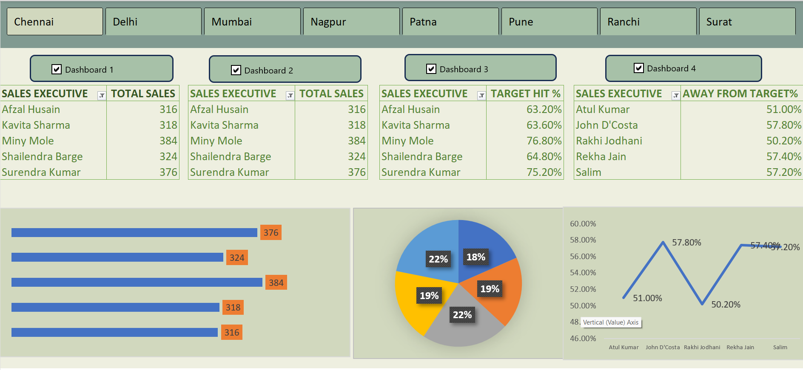

# Excel Sales Dashboard Project

## 🖼️ Dashboard Preview

##  Project Overview
This project is an **interactive Excel Dashboard** built using Pivot Tables, Pivot Charts, and Slicers.  
It helps visualize and analyze sales data effectively, making it easier to track key business insights.

##  Project Structure
- **Dashboard Sheet** → Contains the interactive dashboard with KPIs, charts, and slicers.  
- **Raw Data Sheet** → Source data used to build Pivot Tables and Charts.  

## 🔑 Key Features
- Interactive **slicers** to filter data dynamically.  
- Multiple **Pivot Tables** connected to slicers.  
- Visual representation of sales trends using Pivot Charts.  
- KPI highlights for quick insights (e.g., Total Sales, Profit, Quantity, Average Sales).  

## ⚙️ Tools & Skills Used
- Microsoft Excel  
- Pivot Tables & Pivot Charts  
- Slicers & Timelines  
- DATEDIF Formula (for date calculations)  
- Data Cleaning & Formatting    

✨ Feel free to fork, improve, and share feedback!
